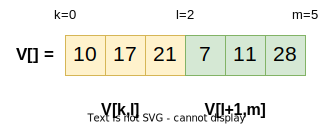
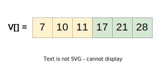

# Vetores

__Definição__. Variável composta Homogênea que agrupa valores de um __mesmo tipo__ sob a referência de um único __nome__.

1. Considere que:
    * Valores são acessados individualmente
    * O acesso é feito por meio de índice
    * Os índices variam entre [0,N-1], *N* é o tamanho do vetor

2. Sintaxe
    *<tipo_do_vetor> Nome_do_vetor [<tamanho>];*
---
# Vetores (II)

1. Exemplos de definição
```C
int faltas[62];
double notas[62];
char nome_aluno[62][100];
```

2. Exemplos de acesso
```C
printf("%d", faltas[0]);
printf("%s", nome_aluno[5]);
```

---
# Atividade: O maior

Escreva um algoritmos que encontre o Maior valor em um vetor não ordenado, que representa o número de faltas dos alunos da disciplina.

Seu programa deve imprimir o maior valor encontrado, seguido pelo índices dos elementos do vetor que tem valor igual ao valor indicado.

Considere o seguinte vetor V={10,3,5,6,7,10}, com 6 elementos. O seu programa deve produzir como saida o seguinte resultado: 
* maior: 10
* indice(s): 0 5

---
# Atividade: O Endereço
Defina um vetor com 10 elementos dos tipos __double__, __int__, e __char__.

Em seguida realize a seguintes operações:
```C
printf("%p\n", nome_do_vetor_de_int);
printf("%p\n", nome_do_vetor_de_double);
printf("%p\n", nome_do_vetor_de_char);

printf("%p\n", nome_do_vetor_de_double);
printf("%p\n", nome_do_vetor_de_double+9);
printf("%lf\n", *nome_do_vetor_de_double);
```

Aponte ao colega as saídas. Se ele discordar, qual é a visão dele?

---
# Atividade: Intercalação
Um vetor __V__ de inteiros foi divido em duas partes indexadas pelas variávies __k, l e m__. A primeira parte do vetor é indexada no intervalo [k,l] e a segunda parte do vetor é indexada no intervalo [l+1,m]. Escreva um programa que intercale essas duas partes armazenando o resultado da intercalação no vetor __V__.

---
# Atividade: Intercalação (Instância)
| Instância                              |      | Resultado |
|--------------------                    |----- |---        |
|      |


---
# Atividade: LSE Operações posicionais

Implementar as operações de __remoção__ do inicio da lista e no final da lista.
1. Remover do __inicio__
    * Redefine o inicio da lista;
    * Remove o __elemento__ mas retorna a __carga útil__;
2. Remover do Final.
    * Redefine quem é o elemento na última posição da lista;
    * Descobrir quem são os elementos das seguintes posições: última e a penultima;
---
# Atividade: LSE Operações posicionais (Particularidades)
1. Lista vazia?
    * Como caracterizar esse estado.
2. Remoção do elemento no final da lista pode tornar a lista vazia.
    * O que fazer?

----
# Atividade: Generalização.


----
# Lista: 