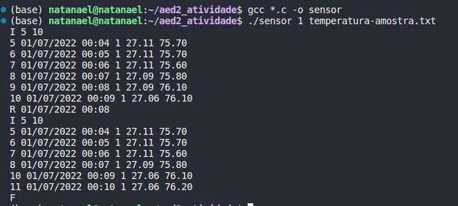

# Atividades
Aqui você vai encontrar os enunciados de todos os trabalhos apresentados neste semestre.

# Uso de listas neutralizadas

Neste trabalho você precisará implementar listas que serão capazes de armazenar um conjunto de dados gerado por diferentes sensores que detectam e registram os eventos em uma área monitorada.

Os sensores foram distribuídos para medir condições ambientais, e.g., temperatura e das massas de ar. Cada sensor portanto registra medições distintas que tem seus atributos.

Sua tarefa consiste em ler todas as medidas, armazenadas em um arquivo, e incluí-las na lista de eventos.

As medidas relacionadas a __temperatura__ têm os seguintes atributos:

```json
{  seq :inteiro,
   dia:inteiro,
   mes:inteiro,
   ano:inteiro,
   hora:inteiro,
   minuto:inteiro,
   radiacao_solar:inteiro,
   temperatura:double,
   umidade_relativa: double
}
```

As medidas relacionadas as massas de ar têm os seguintes atributos:

```json
{  seq:inteiro,
   dia:inteiro,
   mes:inteiro,
   ano:inteiro,
   hora:inteiro,
   minuto:inteiro,
   velocidade_media:double,
   velocidade_instantanea:double,
   direcao: inteiro
}
```
### O que fazer?

Após armazenar os eventos nas suas respectivas listas, seu programa deve manipular os eventos armazenados nas listas, conforme os seguintes comandos:  

1) R dia/mes/ano hora:min - Remover o evento que ocorreu na data especificada.
2) I x y - Imprimir os elementos no intervalo $[x,y]$
3) A x - Acessar o elemento $x$ 
4) B dia/mes/ano hora:min - Buscar um evento que ocorreu na data especificada
5) P x y - Podar(remover) todos os elementos no intervalo $[x, y]$     
5) F - Fim dos comandos

### Considerações:

1) Os valores de $x$ e $y$ podem ser negativos, o que deve levar o acesso a acontecer do último para o primeiro elemento;
2) A lista de *todos* os eventos será criada sempre inserindo os novos eventos no __final__;
3) Existem dois momentos de entrada do programa:
   * informe do tipo de sensor (1 - temperatura; 2 - massas de ar) e nome do arquivo onde estão as informações;
   * Informe dos Comandos que precisam ser executados; 

Veja abaixo os exemplos de como o seu programa será executado:
```csh
> sensor 1 nome_arquivo_temperatura.txt
```
```csh
> sensor 2 nome_arquivo_massas_de_ar.txt
```


### Nomeclaturas

1) O arquivo com o seu programa (solução) deve ter o seguinte nome: sensor.c

### Como submeter o seu programa

1) Deve ser submetido via colab.
2) Somente o arquivo __sensor.c__ precisa ser enviado.

### Comandos extras.

A seguir você vai ver algumas dicas de como a linguagem C dá suporte a leitura de dados via arquivo e como você pode ler informações passadas via linha de comando.

```C
#include "stdio.h"
#include "listase.h"

int main(int argc, char const *argv[]){
   
   const int tipo = atoi(argv[1]);

   const char* nome_arquivo = argv[2];

   FILE *arq = fopen(nome_arquivo, "r");

   fscanf(arq,<mascara>,<lista de variáveis>); 
}
```

### Resumo da tarefa
1. Instanciar a lista para o tipo de medição informado
2. Ler e armazenar todas as informações do arquivo na lista
3. Processar todos os comandos Conforme indicado na seção "O que fazer?"

### Exemplos



O Exemplo acima mostra a utilização das funções I, R e F.


O Exemplo acima mostra a utilização das funções I, P e F.


O Exemplo acima mostra a utilização das funções I, A, B, E e F.


## Uso de TAD - Tipo Abstrato de Dados

Neste trabalho você precisará implementar as três possibilidades de representar uma fila com prioridade, isto é: 
- Container (vetor/lista) não ordenado
- Container (vetor/lista) totalmente ordenado
- Container (heap) parcialmente ordenado

Ao final da implementação você precisará compara-las sob a perspectiva do número de comparações entre elementos armazenados no container. Especificamente, as operações em que ocorre comparações entre elementos na fila com prioridade são estas:

- Inserir_FCP(): inserir um novo elemento
- Remover_FCP(): retirar o maior/menor elemento 
- Primeiro_FCP(): retornar o maior/menor elemento

e para cada uma dessas operações, você precisará indicar quantas comparações foram realizadas em cada uma dessas operações, ao final do uso do container. Para isso, implemente instrumentalizações na estrutura de dados usadas que vai contar, sempre que cada operação citada anteriormente for executada, o número de comparações entre elementos. Para o caso do heap

```C
   struct heap{
    void* *elem;
    int ocupacao;
    int tamanho;
    int e_infinito;

    int nro_cmp_ins; // contador para comparações na inserção
    int nro_cmp_pri; // contador para comparações retornar o primeiro
    int nro_cmp_rem; // contador para comparações na remoção

    TCompararHeap comparar;
   };

static void desce_no_heap(t_heap* h, int k){
    int imaior = k;

    if ((2*k+1<h->ocupacao) && (h->comparar(h->elem[imaior],h->elem[2*k+1])<0)){
        imaior = 2*k+1;
    }
    if ((2*k+2<h->ocupacao) && (h->comparar(h->elem[imaior],h->elem[2*k+2])<0)){
        imaior = 2*k+2;
    }

    h->nro_cmp_rem += 2; // contando na remoção dois por operação
    if (imaior!=k){
        trocar(h->elem, k, imaior);
        desce_no_heap(h,imaior);
    }

}

static void sobe_no_heap(t_heap* h, int k){
    int kancestral=(k/2.0)-1;
   
    h->nro_cmp_ins++; // contando na inserção
    if ((kancestral>=0)&&(h->comparar(h->elem[kancestral],h->elem[k])<0)){
        trocar(h->elem, k, kancestral);
        sobe_no_heap(h, kancestral);
    }
}

```

Faça definições e instrumentalize o código de forma similar para as demais estruturas usadas nas implementações das outras duas formas de construir fila de prioridade (vetor não ordenado/vetor ordenado). 

Para a implementação feita com o vetor não ordenado, a definição do tipo é como segue:

```C
struct vetor_nao_ordenado{
   void* *elem
   int ocupacao;
   int tamanho;
   int e_infinito;

   int nro_cmp_ins; // contador para comparações na inserção
   int nro_cmp_pri; // contador para comparações retornar o primeiro
   int nro_cmp_rem; // contador para comparações na remoção

   TCompararVNOrd comparar;
}
```

É preciso que você implemente as seguintes interfaces:

- criar_vnordenado() // instanciar o vetor não ordenado
- inserir_vnordenado() // inserir um novo elemento
- remover_vnordenado() // remover um elemento específico do vetor
- maior_vnordenado() // descobre e retorna qual é o elemento de maior valor do vetor
- menor_vnordenado() // descobre e retorna qual é o elemento de menor valor no vetor

Para a implementação feita com o __vetor completamente ordenado__, a definição do tipo é similar a apresentada para o vetor não ordenado. 


```C
struct vetor_ordenado{
   void* *elem
   int ocupacao;
   int tamanho;
   int e_infinito;

   int nro_cmp_ins; // contador para comparações na inserção
   int nro_cmp_pri; // contador para comparações retornar o primeiro
   int nro_cmp_rem; // contador para comparações na remoção

   TCompararVOrd comparar;
}
```

Também será necessário criar interfaces para manipular o vetor complemente ordenado, como segue:

- criar_vordenado() // instanciar o vetor completamente ordenado
- inserir_vordenado() // inserir um novo elemento
- remover_vordenado() // remover um elemento específico do vetor
- maior_vordenado() // descobre e retorna qual é o elemento de maior valor do vetor
- menor_vordenado() // descobre e retorna qual é o elemento de menor valor no vetor


Os valores armazenados naquelas variáveis (__nro_cmp_ins, nro_cmp_pri, nro_cmp_rem__) precisam ser acessadas por meio de interfaces chamadas:

- estatistica_vnordenado() // imprimir nro comparações
- estatistica_vordenado() // imprimir nro comparações
- estatistica_heap() // imprimir nro comparações 

```C
nro comparações inserção: 
nro comparações remoção: 
nro comparações primeiro:
````

## Nomeclaturas

Nome os arquivos conforme indicado abaixo:
- vordenado.c e vordenado.h
- vnordenado.c e vnordenado.h
- heap.c e heap.h

para cada um dessas implementações você precisa implementar uma solução que faça uso:
- usaordenado.c
- usavordenado.c
- usaheap.c

Para as soluções que você implementar, use as seguintes definições:

```C
typedef struct carro{
    char placa[9];
    int hora, min;
}t_carro;

t_carro* criar_carro(char placa[], int hora, int min){
    t_carro *c = malloc(sizeof(t_carro));

    strcpy(c->placa,placa);
    c->hora = hora;
    c->min = min;

    return c;
}

int compararCarro(void* c1, void* c2){
    t_carro* cc1 = c1;
    t_carro* cc2 = c2;

    return strcmp(cc1->placa, cc2->placa);
}

void destroy_carro(t_carro *c){
    free(c);
}

void imprimir_carro(t_carro* c){

    printf("Placa: %s %d:%d\n", c->placa, c->hora, c->min);

}
```

Implemente uma dinâmica de leitura de dados e de uso dos dados que foram armazenados, permitindo que as operações de inserção e remoção ocorram na estrutura, permitindo que você verifique as diferenças, em termos de comparação, entre as três implementações.

