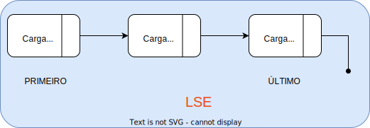
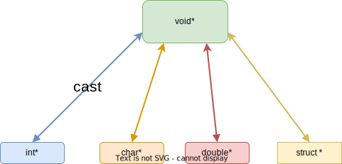

# Sobre Lista

---
# Mas antes, Conceitos abstratos

| Conceito      | Descrição     | Atributos      |
| -----------   | -----------   | ---            |
| Carro         | automóvel, meio de transporte terrestre              |  nro rodas, cor, chasi, nro portas              |
| Celular       |  aparelho de comunicação| cor, modelo, marca,  sistema operacional, cameras, memória,  operadora, tamanho da tela |
| Lista         | agrupador de elementos |  Tamanho, Tipo de Informação, Tem ordenação, 


---

# Definição
__Lista lineares são estruturas de dados permitem o armazenamento de dados em memória de forma não contínua.__

----
# Propriedades
Uma lista $L$ com $n$ elementos tem as seguintes propriedades:

* Seja $l_i$ um elemento de L, então $l_{i-1}$ precede $l_i$ e $l_{i+1}$ sucede $l_i$;
    * Último elemento de $L$, $l_n$ não tem sucessor;
    * Primeiro elemento de $l$, $l_1$ não tem predecessor.
* Para acessar o elemento $l_i$ é preciso acessar todos os elementos $l_j$, $j=1,...,i-1$.


----
# LSE - Lista Simplemente Encadeada
1) Representação Gráfica



2) Implementação
```C
typedef struct {
    t_elemento_lse* inicio;
    int tamanho;
}t_lse;
```
---
# Elemento da Lista
1. __Representação__ 

2. __Definição__                           
```C                                                        
 typedef struct elem_lse{                          
    int cargautil;// carga util            
    struct elem_lse* prox;// endereco prox 
 } t_elemento_lse;                                        
 ```                                       

----
# Caso de uso: Playlist de música 

1. As últimas músicas tocadas
    * Como a lista será organizada?
    * Onde deve ocorrer as inserções?
2. As músicas mais tocadas
    * Tem um limite?
    * Quem deve sair em uma lista com as 10+ tocadas?

---
# Operação Posicional: Inserir no **inicio**
__Permite que um novo elemento seja inserido no -inicio- da Lista $L$ de elementos__
1. Instanciar um novo elemento da lista
    * O elemento tem __carga util__ e __endereço do sucessor__
2. Redefinir o status de __primeiro__ elemento da lista
    * __Novo elemento__ deve ser conectado à lista
    * o campo __inicio__ da lista deve ser atualizado  
3. Atualizar a quantidade de elementos

---
# Operação Posicional: Inserir no **final**
__Permite que um novo elemento seja inserido no -final- da Lista $L$ de elementos__
1. Instanciar um novo elemento da lista
    * O elemento tem __carga util__ e __endereço do sucessor__
2. Redefinir o status de __último__ elemento da lista
    * __Novo elemento__ deve ser conectado à lista;
    * Identificar o elemento que possui o status de __último__ da lista;
    * Atualizar seu campo __prox__ com o endereço do novo elemento. 
3. Atualizar a quantidade de elementos

---
# Operação Posicional: Acessar
__Permite acessar um elemento da Lista $L$ em um determinada posição $i \in \{1,...N\}$.__

1. Garante o acesso em ordem natural $[1,N]$
    * $i = i \% N$, se $i != N$;
    * $i = N$, se $i = k*N, k \in [1,...,m]$;
    * $i = 0$ é considerado um valor inválido. 
2. Garante o acesso em ordem reversa $[-1,-N]$
    * $i = (i \% N) + (N+1)$, se $i != -N$
    * $i = 1$, se $i = k*N, k \in [-1,...,-m]$. 

---
# Operação Posicional: Remover do __inicio__

__Permite que o elemento com status de -primeiro- da Lista $L$ seja removido__

1. Identificar o elemento e armazenar o seu endereço
    * Use informação do campo __inicio__ da lista instanciada;
2. Atualizar o campo __inicio__ da lista
    * Use a informação no campo __prox__ do elemento identificado no passo 1;
3. Remover o elemento fisicamente da memória
    * Copie a informação no campo __cargautil__ do elemento identificado no passo 1;
    * Use o comando __free()__;
4. Retornar a informação copiada no passo anterior.


---
# Operação Posicional: Remover do __final__

__Permite que o elemento com status de -último- da Lista $L$ seja removido__

1. Identificar o elemento e armazenar o seu endereço
    * É preciso caminhar pela lista $L$ até o último elemento e idenficar o penúltimo elemento, conjuntamente;
2. Atualizar o status de -último- elemento da lista
    * Atualize a informação no campo __prox__ do penúltimo elemento identificado no passo 1;
3. Remover o elemento fisicamente da memória
    * Copie a informação no campo __cargautil__ do elemento com status -último- identificado no passo 1;
    * Use o comando __free()__;
4. Retornar a informação copiada no passo anterior.

----
# Acomplamento entre a ED e Tipos

    A lista criada até agora aceita apenas cargautil de valor inteiro
```C
typedef struct elem_lse{                          
    int cargautil;      
    struct elem_lse* prox;// endereco prox 
 } t_elemento_lse;           

int acessar_lse(t_lse* lse, int pos){
void inserir_inicio_lse(t_lse* lse, int carga);
void inserir_final_lse(t_lse* lse, int carga);
int remover_inicio_lse(t_lse* lse);
int remover_final_lse(t_lse* lse);
```
---
# Neutralização da ED: Por que? 
    Armazenamento de mais informações na lista tem implicações na programação 
1. Alterar assinaturas das operações;
    * lista de novos itens que definem a __cargautil__
2. Alterar a lógica das operações
    * qual valor retornar entre os muito armazenados?
    * É possível que seja preciso retornar todos.

----
# Neutralização de ED: o Tipo ponteiro void*

| Definição | Representação | 
| --------- | -------------- |
| __Permite que a variável declarada <br> armazene endereços de memória <br> de qualquer tipo de dado.__          |  |

---
# Neutralização da LSE: Implementação

1. Trocar todos as referências do __int__ para __void*__;
2. Criar as cargas __no código__ de quem está usando a Lista;
    * Especialização fica na solução (__minhasolucao.c__);
3. Qualquer solução deve passar a referência (__endereço memória__) da carga que vai na lista;
    * Implemente uma função (__criar*__)para instanciar a carga;
4. Qualquer solução deve saber tratar a referência (__endereço de memória__)
    * Implemente uma função (__imprimir*__) para imprimir a carga; 

---
# Neutralização da ED LSE: Casos de Uso.

Considere a criação das seguintes Listas:
1. Lista de alunos da disciplina: __matricula__(int), __notafinal__(double), __nro_faltas__(int).
2. Lista de medidas de temperatura: __coordenadaX__(double), __coordenadaY__(double), __temperatura__(double).
3. Lista de eventos: __hora__(int), __minuto__(int), __segundo__(int), __nro_evento__(int) $\in [1,5]$ 

---
# Operações baseadas em conteúdo
A lista precisa ser manipulada a partir dos valores armazenados.
1. __Inserir__ mantendo a ordem estabelecida pelo valor dos elementos;
    * A ordem alfabética de nome de alunos;
    * A ordem temporal (datas) de uma coleta de eventos;
2. __Remover__ um elemento considerando alguma informação associada;
    * Matricula do aluno;
    * ID sensor;
3. __Buscar__ um elemento considerando alguma informação associada;
    * Nome da música;
    * Matricula do aluno;

---
# Neutralizando a lógica
<!--footnote Precisamos de uma lógica não especialista envolvendo as operações.-->

1. Considere a lógica da operação __buscar__
    * Percorrer a lista;
    * Comparar a informação na __cargautil__ com aquele procurada;
    * Retornar a __cargautil__ sempre que ela tiver a informação buscada;
2. Como realizar as comparações?
    * o tipo void* não permite operações de acesso especializada;
    * Veja o que acontece sempre que você programa usando o __void*__;

---
# Ponteiro para função: O que é.
<!--Uma função tem a sua assinatura associada a uma lógica.-->

1) Defina uma função a seguinte função:
```C
void __trocar(int *nro1, int* nro2){
    int aux;
    aux = *nro1;
    *nro1 = *nro2;
    *nro2 = aux;
}
```
2) Agora defina uma função __main()__ com o seguinte código:
```C
int main(){
    printf("%p",__trocar);
}
```
3) Compile e execute o código 5x e veja o que acontece.

---
# Ponteiro para função: Como definir.

1) Escreva o seguinte código no arquivo **.c**, logo após os **#include**
```C
typedef void(*da_funcao_trocar)(int*, int*);
```
2) Na função principal escreva o seguinte código:
```C
// declarando uma variável 
da_funcao_trocar trocador;

// atribuindo um endereço para a variável
trocador = __trocar;

printf("%p\n", __trocar);
printf("%p\n", trocador);
```

---
# Ponteiro para função: como usar.

1) Escreva o seguinte código na função __main()__, compile, execute e anote o resultado
```C
int maior=10;
int menor=20;
__trocar(&maior, &menor);
printf("%d %d\n", maior, menor);
```
2) Altere o código, incluindo
```C
trocador = __trocar;

// chamada indireta da função
trocador(&maior, &menor);

printf("%d %d\n", maior, menor);
``` 

---
# Ponteiro para função: como usar na parametrização.
1) Inclua o seguinte código no arquivo **.c**
```C
void chamadora(da_funcao_trocar trocador, int nro_1, int nro_2){
    printf("%d %d\n", nro_1, nro_2);
    // chamada indireta da função
    trocador(&nro_1, &nro_2);
    printf("%d %d\n", nro_1, nro_2);
}
```
2) Inclua o seguinte código na função __main()__
```C
chamadora(__trocar, maior, menor);
```
---
# E na LSE? vamos refatorar.


---
# Refatorar LSE
1) Crie o novo arquivo **listase.h**
    * inclua a assinatura das funções;
    * remova os itens anteriores do arquivo **listase.c**
2) ainda no arquivo **listase.h**, inclua o seguinte código, logo após os **#include**;
```C
typedef void(*t_imprimir_lse)(void*);
typedef struct lse t_lse; 
```
---
# Vamos refatorar **listase.c**
1) no arquivo **listalse.c**, redefina a LSE incluindo
```C 
struct lse{
    t_elemento_lse* inicio;
    int tamanho;
    t_imprimir_lse impressora;
};
```
2) redefina a assinatura da função **criar_lse()**
```C
    t_lse* criar_lse(t_imprimir_lse imprimir){
        t_lse* nova  = malloc(sizeof(t_lse));
        nova->inicio = NULL;
        nova->imprimir = imprimir;
        nova->tamanho=0;

        return nova;
    }
```
---
# Último ajuste, no listase.c
1) Inclua o código que percorre a lista imprimindo os elementos.
```C
void imprimir_lse(t_lse *lse){
    t_elemento_lse* cam;
    while(cam!=NULL){
        lse->imprimir(cam->cargautil);
        cam = cam->prox;
    }
}
```

---
# Atividade: criando e manipulando playlists
1) Apresente e implemente o conceito de um música;
    * use o __typedef__ para criar o tipo que representará o conceito;
2) Crie um arquivo chamado "playlist.c"
    * Defina o conceito de um playlist +10;
    * Defina o conceito de uma playlist aleatória;
    * Defina o conceito de uma playlist as últimas **k* tocadas;

---
# 
