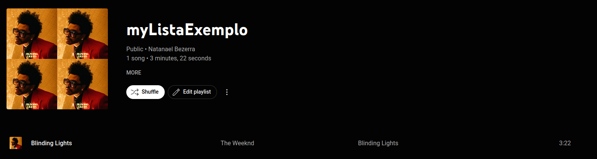

# Pré-AED2

## Sumário

1. [Introdução](#introdução)

2. [Variáveis](#variáveis)

    2.1. [Int](#int)

    2.2. [Double](#double)

    2.3. [Ponteiro](#ponteiro)

    2.4. [Struct](#struct)

3. [Vetores](#vetores)

4. [String](#string)

5. [Lista Encadeda](#lista-encadeada)

    5.1 [Contruindo Um Tipo Abstrato de Dados Music](#construindo-um-tipo-abstrato-de-dados-music)

    5.2 [Construindo Uma Lista Encadeda Simplismente Encadeada](#construindo-uma-lista-encadeda)

6. [Generalização de Funções](#generalização-de-funções)    

## Introdução

Este conteúdo foi feito como base no depoimento de alunos que pagaram a disciplina de algoritmo e estruturas de dados II e tiveram dificuldades.

As dificuldades relatadas foram compiladas neste matérial para facilitar para os futuros alunos da disciplina.

## Variáveis

Em programação, uma variável é um espaço de memória reservado para armazenar um valor que pode ser modificado durante a execução do programa.

### Int

Variáveis do tipo inteiro são usadas para armazenar números inteiros em programação. Entretanto, na linguagem C, o int possui algumas variações que diferem em tamanho e capacidade de armazenamento.

Existem diversas variações do int em C, cada uma com um tamanho e capacidade de armazenamento diferentes. Aqui estão algumas das variantes mais comuns do int:

Tipo | Total de bits | Quanto armazena
-----|---------------|----------------
short int | 2 | -32.768 a 32.767
unsigned short int | 2 | 0 a 65.535 
int  |    32         | -2.147.483.648 a 2.147.483.647
unsigned int | 32    | 0 a 4.294.967.295
long int | 64 | -9.223.372.036.854.775.808 a 9.223.372.036.854.775.807
using long int | 64 | 0 a 18.446.744.073.709.551.615


Mas porquê há tantas variantes diferentes? suponhamos que você quer fazer o cálculo de quanto os alunos da ufam ganham durante um ano. É claro que a soma não vai ser superir a 32.000 reais, então ao usar uma variável short, você vai usar apenas 2 Bytes ao invés de 4 Bytes, economizando assim mémoria.

### Double

Double é usado para armazenar números reais.

### Char

Char é capaz de armazenar valores de -128 a 127, e a unsigend char consegue armazenar valores de 0 a 255.

Comumente usamos o tipo char para armazenar caracteres.

### Ponteiro

As variáveis do tipo ponteiro em C são variáveis que armazenam o endereço de memória de outra variável. Em outras palavras, um ponteiro é uma variável que contém o endereço de memória de uma outra variável.

Em C, o operador & pode ser usado para obter o endereço de memória de uma variável, e o operador * pode ser usado para acessar o valor armazenado em um endereço de memória.

Para declarar um ponteiro em C, use o tipo de dados seguido de um asterisco (*), seguido pelo nome da variável. Por exemplo, para declarar um ponteiro para um inteiro, você pode escrever:

    int *ponteiro_para_int;

Isso declara uma variável chamada ponteiro_para_int do tipo "ponteiro para inteiro".

Para atribuir o endereço de memória de uma variável a um ponteiro, use o operador &. Por exemplo, para atribuir o endereço de memória de uma variável x a um ponteiro `ponteiro_para_x`, você pode escrever:

    int x = 42;
    int *ponteiro_para_x = &x;

Agora ponteiro_para_x contém o endereço de memória de x.

Para acessar o valor armazenado em um endereço de memória, use o operador *. Por exemplo, para imprimir o valor armazenado em x usando o ponteiro ponteiro_para_x, você pode escrever:

    printf("O valor de x é: %d\n", *ponteiro_para_x);

Isso imprime "O valor de x é: 42" na tela.

Os ponteiros são úteis em C para várias tarefas, incluindo alocação dinâmica de memória, passagem de argumentos para funções por referência e implementação de estruturas de dados avançadas, como listas encadeadas e árvores binárias. No entanto, o uso incorreto de ponteiros pode levar a erros de memória, como vazamentos de memória e acesso a áreas de memória não autorizadas. Por isso, é importante entender bem como os ponteiros funcionam e usá-los com cuidado em seus programas em C.

### Struct

Uma struct é um tipo de variável que permite agrupar múltiplas variáveis em uma única unidade. Em programação, é comum encontrarmos situações em que precisamos lidar com conjuntos de dados complexos que não podem ser representados por uma única variável. É aí que entra a struct!

Por exemplo, imagine que você precisa armazenar informações sobre uma palavra em um livro, como a própria palavra e o número de vezes que ela aparece. Nesse caso, você pode criar uma struct para representar essa informação:

    typedef struct recorrencia {
        char palavra[150];
        int numero_repeticoes;
    } recorrencia;

Essa struct contém duas variáveis: uma string de caracteres chamada "palavra" (que pode armazenar uma palavra com até 150 caracteres) e um número inteiro chamado "numero_repeticoes" (que armazena a quantidade de vezes que a palavra aparece).

Com essa estrutura, você pode criar uma variável para cada palavra que precisa ser contada:

    recorrencia palavra1 = {"Resiliência", 15};
    recorrencia palavra2 = {"Programação", 10};

E agora você pode lidar com cada palavra como um único objeto, acessando as suas propriedades através do ponto ".". 

Por exemplo:

    printf("%s apareceu %d vezes\n", palavra1.palavra, palavra1.numero_repeticoes);

Espero que isso ajude a esclarecer como as structs podem ser úteis para lidar com conjuntos de dados mais complexos em programação!

### Vetores

Em programação, um vetor é uma estrutura de dados que armazena um conjunto de valores do mesmo tipo em uma única variável. Cada valor é identificado por um índice numérico que começa em zero e vai até o tamanho do vetor menos um.

Por exemplo, imagine que precisamos armazenar as notas de uma turma de 10 alunos em uma variável. Uma forma de fazer isso seria declarar 10 variáveis separadas, mas isso seria muito trabalhoso e pouco prático. É aí que os vetores entram em cena! Podemos declarar um vetor de 10 elementos do tipo double (números decimais), como:

    double notas[10];

Este vetor armazena 10 valores do tipo double. Para acessar um elemento específico do vetor, usamos um índice entre colchetes após o nome do vetor. Por exemplo, para atribuir a nota 7.5 ao primeiro aluno, fazemos:

    notas[0] = 7.5;

É importante lembrar que o índice começa em zero, então o primeiro elemento do vetor é o de índice zero. Para acessar o segundo elemento do vetor, usamos o índice 1:

    notas[1] = 8.0;

E assim por diante. Para acessar o último elemento do vetor, usamos o índice igual ao tamanho do vetor menos um:

    notas[9] = 9.0;

Podemos inicializar o vetor com valores conhecidos utilizando a sintaxe de inicialização de vetor. Por exemplo, para inicializar o vetor com as notas de um aluno, fazemos:

    double notas[4] = {7.5, 8.0, 9.0, 7.0};

Neste caso, estamos inicializando o vetor com 4 valores. O compilador C sabe que o tamanho do vetor é 4 porque contou o número de valores na inicialização.

Podemos percorrer todos os elementos do vetor utilizando um laço de repetição. Por exemplo, para imprimir todas as notas do vetor, podemos fazer:

```C
for (int i = 0; i < 4; i++) {
    printf("Nota %d: %.1lf\n", i+1, notas[i]);
}
```

Neste caso, estamos utilizando um laço for que vai de 0 até 3 (o tamanho do vetor menos um) e imprime o índice do elemento e o valor da nota correspondente. O formato "%.1lf" é utilizado para imprimir o valor da nota com uma casa decimal.

Os vetores são uma estrutura de dados muito importante em programação, e são amplamente utilizados para armazenar grandes quantidades de dados em uma única variável. Eles são muito úteis em algoritmos de busca, ordenação, processamento de imagens, entre outras aplicações.

### String

Uma string é uma sequência de caracteres que representa um texto ou uma mensagem. Em C, uma string é representada como um vetor de caracteres (array), onde cada elemento do vetor é um caractere da string. O último caractere do vetor é sempre o caractere nulo ('\0'), que indica o fim da string.

Por exemplo, para declarar uma string que contém o texto "Olá, mundo!", podemos fazer:

    char mensagem[13] = "Olá, mundo!";

Neste caso, estamos declarando um vetor de caracteres chamado "mensagem" que tem tamanho 13 (12 caracteres mais o caractere nulo). É importante lembrar que a string sempre ocupa um caractere a mais do que o tamanho do texto, para armazenar o caractere nulo.

Podemos acessar os caracteres da string utilizando um índice entre colchetes. Por exemplo, para imprimir o primeiro caractere da string, fazemos:

    printf("Primeiro caractere: %c\n", mensagem[0]);

Neste caso, estamos utilizando o formato "%c" para imprimir o caractere correspondente ao índice 0 do vetor.

Podemos percorrer todos os caracteres da string utilizando um laço de repetição. Por exemplo, para imprimir todos os caracteres da string, podemos fazer:

```C
for (int i = 0; i < 13; i++) {
    printf("%c", mensagem[i]);
}
```

Neste caso, estamos utilizando um laço for que vai de 0 até 12 (o tamanho do vetor menos um) e imprime cada caractere da string. O formato "%c" é utilizado para imprimir cada caractere individualmente.

Outra forma possível e mais usada é com o formatodor "%s":

    printf("%s", mensagem);

Podemos modificar os caracteres da string atribuindo um valor a um elemento do vetor. Por exemplo, para alterar o último caractere da string para o caractere '?', fazemos:

    mensagem[12] = '!';

Neste caso, estamos atribuindo o caractere '?' ao último elemento do vetor.

Existem várias funções úteis para manipulação de strings em C, como strlen() para obter o comprimento da string, strcpy() para copiar uma string para outra, strcat() para concatenar duas strings, entre outras.

É importante lembrar que as strings em C são arrays de caracteres, e por isso é fácil cometer erros de buffer overflow (quando se escreve além do espaço reservado para o vetor), especialmente ao manipular strings de tamanho desconhecido. Para evitar esse tipo de erro, é importante sempre verificar o tamanho da string antes de realizar operações com ela, e utilizar funções que garantem a segurança da operação, como strncpy() em vez de strcpy().


### Lista Encadeada

Antes de falarmos sobre listas encadeadas, é importante revisitar o conceito de lista em si. No dia a dia, estamos cercados por listas em diversas formas, como uma playlist de música, uma lista de compras, uma lista de tarefas, entre outras. 

Em programação, uma lista é uma estrutura de dados que permite armazenar um conjunto de elementos em sequência. A lista encadeada é um tipo de lista em que cada elemento, além de armazenar o seu próprio valor, guarda a referência para o próximo elemento da lista, formando assim uma cadeia encadeada de elementos.

Ficou confuso ? Vou mostrar um exemplo de lista que gosto muito, uma playList.


Na imagem acima, podemos observar uma lista de músicas, também conhecida como playlist. É possível notar que cada música é seguida pela próxima da sequência, formando uma ordem para reprodução. Além disso, podemos notar que a lista começa com a música "Blinding Lights", do artista The Weeknd.

### Construindo um tipo abstrato de dados Music.

O objetivo deste texto é auxiliar o maior número de pessoas possível. Se você já possui experiência na área, pode utilizar as ideias apresentadas como desafios para construir os códigos por conta própria. Dito isso, vamos começar.

Em nosso problema, utilizaremos uma lista encadeada que armazenará músicas. Cada música possui diversos atributos, como nome, artista, tempo e ano de publicação, por exemplo. No entanto, para simplificar nosso código, abstrairemos apenas dois atributos, que são o nome da música e o nome do artista. Como a linguagem C não possui um tipo de dados específico para música, vamos implementar o tipo abstrato de dados "Music" em C.

Vamos agora abrir nosso editor de códigos e criar um arquivo chamado "music.h". Em C, arquivos com extensão ".h" são conhecidos como arquivos de cabeçalho, e sua principal função é descrever as funções que o usuário da nossa estrutura de dados poderá utilizar. Esses arquivos geralmente contêm as definições de tipos, constantes e protótipos de funções.

```C
#ifndef MUSIC_H
#define MUSIC_H

typedef struct type_music type_music;

#endif
```

O "ifndef" é uma diretiva de pré-processamento em C que verifica se a constante MUSIC_H já foi definida. Se não foi definida, o código dentro do bloco é executado. Em seguida, utilizamos o "typedef" para definir a struct "type_music" como um tipo de dado.

A seguir, precisamos colocar os prótotipos da função que iremos implementar.

Agora precisamos adicionar os protótipos das funções que iremos implementar. Esses protótipos servem para indicar ao compilador quais funções serão utilizadas no nosso código, permitindo que o mesmo verifique se as chamadas dessas funções estão sendo feitas corretamente.

```C
#ifndef MUSIC_H
#define MUSIC_H

typedef struct type_music type_music;

// Cria uma nova musica.
type_music * new_music(char * musicName, char * artistName);

// Mostra a musica na tela.
void print_music(type_music * music);

#endif
```

Show! Criamos um arquivo de cabeçalho e falamos que iremos implementar duas funções, "new_music" que vai retorna uma ponteiro do tipo "type_music". E a função "print_music" que não terá retorno.

Agora, vamos criar um novo arquivo chamado "music.c" na mesma pasta em que está o arquivo "music.h". O arquivo "music.c" será responsável por implementar as funções que definimos em "music.h". Para isso, abra o seu editor de código de preferência e crie um novo arquivo com o nome "music.c". Lembre-se de salvá-lo na mesma pasta que o arquivo "music.h".

O primeiro passo no arquivo é importar o "music.h".

```C  
#include "music.h"
```

No arquivo "music.c" é que iremos implementar as funções que definimos em "music.h". Além disso, é neste arquivo que vamos definir os atributos do nosso tipo "type_music" e as operações que podemos realizar sobre eles.

```C
#include "music.h"

struct type_music{

    char musicName[30];
    char artistName[30];

};

```

No código acima, definimos a estrutura do tipo "type_music", que possui dois atributos: "musicName", que é uma string com capacidade para até 29 caracteres, e "artistName", que também é uma string com a mesma capacidade. Esses atributos irão armazenar, respectivamente, o nome da música e o nome do artista.

Agora que definimos a estrutura do tipo "type_music", vamos implementar a função "new_music", responsável por criar uma nova música e preencher seus atributos com os valores passados como parâmetro. Essa função irá alocar dinamicamente um espaço na memória para a música e retornar um ponteiro para essa região de memória.


```C
#include "music.h"
#include "stdlib.h" // para usar a funcao malloc
#include "string.h" // para usar a funcao strcpy

struct type_music{

    char musicName[30]; // Nome da musica
    char artistName[30]; // Nome do artista

};

type_music * new_music(char * musicName, char * artistName){

    /* Criando um espaço em memoria do tamanho de um type_music */
    type_music * music = malloc(sizeof(type_music)); 

    /* Copiando o parametro musicName passado como argumento
        para o atributo musicName da minha estrutura music
    */
    strcpy(music->musicName, musicName); 
    strcpy(music->artistName, artistName);

    return music; // Retornando o ponteiro para a musica.
}

```

Por fim, vamos implementar a função "print_music", responsável por exibir na tela as informações da música passada como parâmetro. Essa função irá receber um ponteiro para a música a ser exibida e irá imprimir na tela o nome da música e o nome do artista.


```C
#include "music.h"
#include "stdlib.h" // para usar a funcao malloc
#include "string.h" // para usar a funcao strcpy
#include "stdio.h" // Usar o printf
struct type_music{

    char musicName[30]; // Nome da musica
    char artistName[30]; // Nome do artista

};

type_music * new_music(char * musicName, char * artistName){

    /* Criando um espaço em memoria do tamanho de um type_music */
    type_music * music = malloc(sizeof(type_music)); 

    /* Copiando o parametro musicName passado como argumento
        para o atributo musicName da minha estrutura music
    */
    strcpy(music->musicName, musicName); 
    strcpy(music->artistName, artistName);

    return music; // Retornando o ponteiro para a musica.
}


void print_music(type_music * music){
    // So dar um printf nos atributos musicName e artistName.
    printf("Music: ( Name: %s, Artist: %s )\n", 
        music->musicName, 
        music->artistName
    );
    
}


```

Pronto! Agora temos um tipo abstrato de dados "Music". Vamos testar para ver se tudo está funcionando corretamente.

Para isso, crie um arquivo chamado "main.c" na mesma pasta dos dois arquivos anteriores. Esse arquivo será responsável por realizar os testes das funções implementadas.

```C

#include "stdio.h" 
#include "music.h" // Para usar as funcao do type_music

int main(int argc, char* *argv){

    /*
    aqui estamos criando uma nova musica, passando primeiro o nome e depois o artista.
    */
    type_music * music_1 = new_music("Blinding Lights", "The Weeknd");

    print_music(music_1); // Estamos mostrando a musica
    

}

```

Para testar use os comandos:

```Bash
gcc *.c -o musicTeste
```

```Bash
./musicTeste 
```

Legal! Criamos uma musica! Mas e se eu quiser criar toda a playlist que mostrei lá em cima ?

```C

#include "stdio.h" 
#include "music.h" // Para usar as funcao do type_music

int main(int argc, char* *argv){

    /*
    aqui estamos criando uma nova musica, passando primeiro o nome e depois o artista.
    */
    type_music * music_1 = new_music("Blinding Lights", "The Weeknd");
    type_music * music_2 = new_music("In Your Eyes", "The Weeknd");
    type_music * music_3 = new_music("Enemy", "Imagine Dragons");
    type_music * music_4 = new_music("Peaches", "Justin Bieber");
    type_music * music_5 = new_music("Get Lucky", "Daft Punk");

    // Estamos mostrando as 5 musicas
    print_music(music_1); 
    print_music(music_2);
    print_music(music_3);
    print_music(music_4);
    print_music(music_5);
    

}

```

Note como a criação de uma nova música se tornou simples e fácil utilizando o tipo abstrato de dados que criamos. Se tivéssemos que criar manualmente uma nova música utilizando a função "malloc" e a função "strcpy", seria um trabalho muito mais complexo e demorado. Mas com a nossa estrutura de dados, sempre que quisermos criar uma nova música, basta utilizar a função "new_music".

### Construindo uma lista encadeda

Agora que já criamos o tipo abstrato de dados Music, vamos utilizar esse tipo para construir uma lista simplemente encadeada de músicas. Para isso, vamos criar um novo arquivo de cabeçalho chamado "listase.h".

```C
#ifndef LISTA_H
#define LISTA_H
/* Eh uma lista de musica, entao precisamos importar nosso TAD*/
#include "music.h" 

typedef struct T_LSE T_LSE;

/* Cria uma nova lista simplemente encadeda */
T_LSE* criarLSE();

/* Criando a funcao de inserir no inicio, que recebe uma lista e uma musica*/
void inserir_inicioLSE(T_LSE* listaSE, type_music * music);

/* Remove do inicio de uma lista e retorna a musica removida */
type_music* remover_inicioLSE(T_LSE* listaSE);

/* Remove do inicio de uma lista e retorna a musica removida */
type_music* acessar_LSE(T_LSE* listaSE, int posicao);

/* Insere no final de uma lista encadeda e nao retorna nada*/
void inserir_fincalLSE(T_LSE* listaSE, type_music * music);

/* Remove do final e retorna a musica removida */
type_music * remover_finalLSE(T_LSE* listaSE);

/* Mostra na tela toda a lista*/
void print_listaSE(T_LSE* listaSE);

#endif
```

Feito isso, vamos criar o arquivo "listaSE.c" e vamos começar a implementar nossa lista.

```C
#include "listase.h" // Importando o cabecalho da lista
#include "stdlib.h" // Para usar o malloc
```

Para continuar, vamos pensar em como uma playlist funcina, no meu reprodutor de musica, que é o youtube music, geralmente aperto no play da playlist e começa a tocar as musica e cada musica, ao temerminar, me leva a outra musica até que a playlist acabe.

Nessa exemplo podemos ver que a playList nos levar a uma elemento que armazena a musica e a musica que vai ser tocaca em seguida.

Podemos pensar na playlist como uma lista encadeada, onde cada nó da lista é um elemento da playlist que contém a informação da música e um ponteiro para o próximo elemento da lista, que é a próxima música a ser tocada. Ao dar play na playlist, começamos a tocar a primeira música, e ao finalizar a música, avançamos para o próximo elemento da lista, que contém a próxima música a ser tocada, e assim por diante até chegar ao fim da lista, que seria o fim da playlist.

Dito isto, vamos criar esse elemento.

```C
#include "listase.h" // Importando o cabecalho da lista
#include "stdlib.h" // Para usar o malloc

/* Estamos definindo o tipo elemento da lista*/
typedef struct t_elemento_lse t_elemento_lse;

/* Aqui estamos criando a estrutura desse elemento. */

struct t_elemento_lse{
    /*O primeiro atributo do nosso elemento da lista eh a musica*/
    type_music* cargautil;

    /* E o segundo atributo é o endereco do proximo elemento que ira guardar a proxima musica */
    t_elemento_lse* prox; 
};

```

Agora, vamos definir a estrutura da nossa lista, como mencionei anteriormente, a nossa lista vai nos levar ao primeiro elemento que contém a musica inicial.

```C
#include "listase.h" // Importando o cabecalho da lista
#include "stdlib.h" // Para usar o malloc

/* Estamos definindo o tipo elemento da lista*/
typedef struct t_elemento_lse t_elemento_lse;

/* Aqui estamos criando a estrutura desse elemento. */

struct t_elemento_lse{
    /*O primeiro atributo do nosso elemento da lista eh a musica*/
    type_music* cargautil;

    /* E o segundo atributo é o endereco do proximo elemento que ira guardar a proxima musica */
    t_elemento_lse* prox; 
};

struct T_LSE{
    /* A nossa lista tera um unico atributo que eh o primeiro elemento. No nosso exemplo, vai guardar o endereco do primeiro elemento, que tera a musica e a proxima musica */
    t_elemento_lse* inicio;
};

```

Certo, agora que já definimos a estrutura da nossa lista de reprodução, é hora de implementar as funções que foram declaradas no arquivo "listase.h". 

Quando criamos uma playlist no reprodutor de música, é possível criá-la sem adicionar nenhuma música, deixando-a vazia. Vamos reproduzir esse comportamento em nosso código, implementando uma função que crie uma lista vazia.


```C
#include "listase.h" // Importando o cabecalho da lista
#include "stdlib.h" // Para usar o malloc

/* Estamos definindo o tipo elemento da lista*/
typedef struct t_elemento_lse t_elemento_lse;

/* Aqui estamos criando a estrutura desse elemento. */

struct t_elemento_lse{
    /*O primeiro atributo do nosso elemento da lista eh a musica*/
    type_music* cargautil;

    /* E o segundo atributo é o endereco do proximo elemento que ira guardar a proxima musica */
    t_elemento_lse* prox; 
};

struct T_LSE{
    /* A nossa lista tera um unico atributo que eh o primeiro elemento. No nosso exemplo, vai guardar o endereco do primeiro elemento, que tera a musica e a proxima musica */
    t_elemento_lse* inicio;
};

T_LSE* criarLSE(){

    /* Aqui estamos criando um espaco na memoria do tamanho de uma T_LSE, ou seja, estamos criando uma nova lista */
    T_LSE* nova = malloc(sizeof(T_LSE));
    
    /* Se uma lista esta vazia, entao seu inicio e nulo, ou seja, ela nao tem nenhum elemento inicial.
    */
    nova->inicio = NULL;

    /* Por fim retornamos nossa lista vazia */
    return nova;
}
```

Com a função "criarLSE" conseguimos replicar o comportamento do reprodutor de música ao criar uma playlist, como na figura a seguir.


Agora vamos inserir uma música nessa playlist, o resultado seria esse:



Veja que antes o inicio da "myListaExemplo" era nulo, mas como eu adicionei uma elemento, o inicio passou a apontar para esse elemento.

A primeira pergunta. Qual é esse elemento? Bem, esse elemento é a musica "Blinding Lights" e o proximo elemento, que esse caso é nulo, já que não existe próxima musica. Criando uma função para criar esse elementos temos.


```C
/* Estamos recendo uma musica e criando um elemento com essa musica */
t_elemento_lse* criar_elemento_lse(type_music* cargautil){
    /* Estamos criando um novo elemento (pedindo uma memoria do tamanho de t_elemento_lse) */
    t_elemento_lse* novo = malloc(sizeof(t_elemento_lse));

    /* Estamos iniciando o campo cargaultil, que no nosso contexto é uma musica. */
    novo->cargautil = cargautil;

    /* Falando que esse elemento não em proximo */
    novo->prox = NULL;

    /* Retornando o novo elemento */
    return novo;
}
```

Agora vamos construir a função para inserir no inicio na playlist.

```C

void inserir_inicioLSE(T_LSE* listaSE, type_music * music){

    /* Estamos criando um novo elemento com a musica passada com argumento da funcao */
    t_elemento_lse* elementoNovo = criar_elemento_lse(music);

    /* Antes o inicio era nulo, mas agora ele vai apontar para meu novo elemento */
    listaSE->inicio = elementoNovo;
}


```

Com isso, simulamos o que aconteceu nas imagens acima. Seguindo vamos adicionar mais uma música na playlist.


Note que antes o inicio era "Blinding Lights", mas agora o inicio é "in your eyes" e que a música seguinte a "in your eyes" é "Blinding Lights" (que antes era o inicio), então vamos ter que atualizar o código para essa situação.

```C

void inserir_inicioLSE(T_LSE* listaSE, type_music * music){

    /* Estamos criando um novo elemento com a musica passada com argumento da funcao */
    t_elemento_lse* elementoNovo = criar_elemento_lse(music);

    /* O proximo do novo elemento eh o antigo inicio */
    elementoNovo->prox = listaSE->inicio;

    /* Antes o inicio agora vai apontar para meu novo elemento */
    listaSE->inicio = elementoNovo;
}


```

Com isso está feita nossa função de inserir no inicio.
Inserimos, agora vamos remover do inicio. Nesse exemplo, o primeiro elemento da lista tem a musica "in your eyes" e aponta para o proximo elemento que tem a musica "Blinding Lights". Se eu vou remover a "in your eyes" quem será a primeira música ?

```C

type_music* remover_inicioLSE(T_LSE* listaSE){

    /* Estamos guardando o elemento que iremos remover (que eh o primeiro) na variavel removido. */
    t_elemento_lse* removido = listaSE->inicio;

    /* Estamos criando uma variavel para amazernar a musica que sera removida da lista */
    type_music* conteudoRemovido = NULL;

    /* Caso a minha lista esteja vazia o inicio eh null */
    if(removido != NULL){
        /* Aqui entra o exemplo que dei a cima, quem vai ser a nova primeira musica ? "Blinding Lights", que esta no elemento seguite a "in your eyes".
        Resumindo: o elemento removido contem "in your eyes" e o elemento seguinte a ele guarda "Blinding Lights" */
        listaSE->inicio = removido->prox;

        /* Guardo a musica removida na variavel conteudoRemovido*/
        conteudoRemovido = removido->cargautil;

        /* Libero a memoria do elemento*/
        free(removido);
    }

    /* retorno a musica*/
    return conteudoRemovido;

}

```

Com o código acima podemos remover do inicio de uma lista, agora vamos construir a função "acessar_LSE".

```C
type_music* acessar_LSE(T_LSE* listaSE, int posicao){

    /* Vamos começa guardando o primeiro elemento da lista em uma variavel auxiliar */
    t_elemento_lse* aux = listaSE->inicio;

    /* Vamos criar uma variavel para armazenar a musica que sera retornada */
    type_music * elementRetorno = NULL;

    /* Vamos iniciar o indice em 1, isso eh, nosso primeiro elemento da lista ta na posicao 1 */
    int index = 1;
    
    /* Agora vamos percorrer enquanto index <= posicao. Por exemplo, se eu quero a posicao 3, ele vai ficar no while ate chegar no 3. Mas e se eu estiver procurando uma posicao que nao existe? para que isso nao aconteca eh necessario que aux nao seja nulo, ou seja, tem que exitir um elemento para que eu possa continuar. */
    while ( index <= posicao && aux != NULL){
        
        /* Se a posicao for igual ao index, significa que achi quem estou atras. */
        if(posicao == index){
            
            /* Guardo o conteudo esse elemento na variavel de retorno */
            elementRetorno = aux->cargautil;
            
            /* Retorno esse conteudo */
            return elementRetorno;
        }

        /* Vou para o proximo elemento da lista*/
        aux = aux->prox;

        /* Incremento o index */
        index++;
    }

    /* Caso nao ache, ele retorna NULL */
    return elementRetorno;
    
    
}

```

Seguindo, vamos inserir no final da lista.

```C

void inserir_fincalLSE(T_LSE* listaSE, type_music * music){

    /* Vamos começa guardando o primeiro elemento da lista em uma variavel auxiliar */
    t_elemento_lse* aux = listaSE->inicio;

    /* Estamos criando um novo elemento com a musica passada com argumento da funcao */
    t_elemento_lse* elementoNovo = criar_elemento_lse(music);


    if(aux != NULL){

        /* Como sabemos que uma lista chegou ao fim? Quando o campo proximo eh NULL, logo pasta fazer um loop equanto o proximo for diferente de NULL. */
        while (aux->prox != NULL){ aux = aux->prox; }
        
        /* No fim no loop, meu aux vai ser o ultimo elemento da lista. Entao, basta dizer que o proximo elemento do ultimo e o novo elemento. */
        aux->prox = elementoNovo;

    }else{
        /* Se aux for NULL, significa que a lista esta vazia. */
        listaSE->inicio = elementoNovo;
    }

}

```

Por fim, vamos criar a função para mostrar a lista encadeada.

```C
void print_listaSE(T_LSE* listaSE){

    /* Vamos começa guardando o primeiro elemento da lista em uma variavel auxiliar */
    t_elemento_lse* aux = listaSE->inicio;

    /* Como sabemos que uma lista chegou ao fim? Quando o campo proximo eh NULL, logo pasta fazer um loop equanto o aux for diferente de NULL. */
    while (aux != NULL){
        
        /* Usa o metodo print da TAD Music passando a musica para ela. */
        print_music(aux->cargautil);

        /* Vai para o proximo elemento. */
        aux = aux->prox;
    }
    
}
```

Ufa! Deu trabalho ein! Vamos testar e torcer para funcionar.

Vamos lá no arquivo "main.c" que fizemos no código da TAD Music.

```C
#include "stdio.h"
#include "music.h"
#include "listase.h" // Agora vamos incluir nossa lista

int main(int argc, char* *argv){

    /* Aqui vamos criar a playList */
    T_LSE* playList = criarLSE();

    /* Criando a musica */
    type_music * music_1 = new_music("Blinding Lights", "The Weeknd");

    /* Inserindo no final da lista */
    inserir_fincalLSE(playList, music_1);

    type_music * music_2 = new_music("In Your Eyes", "The Weeknd");

    /* Inserindo no final da lista */
    inserir_fincalLSE(playList, music_2);

    type_music * music_3 = new_music("Enemy", "Imagine Dragons");

    /* Inserindo no final da lista */
    inserir_fincalLSE(playList, music_3);

    type_music * music_4 = new_music("Peaches", "Justin Bieber");
    
    /* Inserindo no final da lista */
    inserir_fincalLSE(playList, music_4);

    type_music * music_5 = new_music("Get Lucky", "Daft Punk");

    /* Inserindo no final da lista */
    inserir_fincalLSE(playList, music_5);

    /* Mostrando toda a lista */
    print_listaSE(playList);

}

```

Para testar use os comandos:

```Bash
gcc *.c -o musicTeste
```

```Bash
./musicTeste 
```


### Generalização de Funções

Conhece o void* ? 